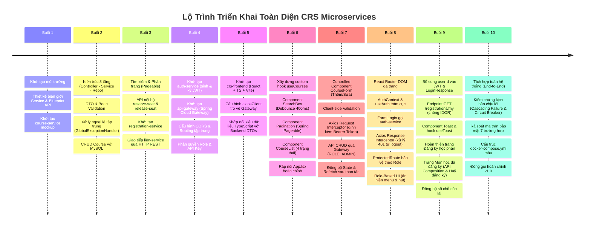

# Tổng Quan Tiến Trình Phát Triển Hệ Thống CRS (Buổi 1 — Buổi 10)

Tài liệu tổng kết toàn bộ lộ trình kiến trúc, các cột mốc tính năng, kiểm thử tích hợp đầu-cuối (end-to-end), khả năng chịu lỗi (fault tolerance), ma trận bảo mật và hướng dẫn triển khai Docker Compose trong dự án **CRS Microservices** (Course Registration System).

---

## 1. Bản Đồ Tiến Trình Toàn Khóa Học (Buổi 1 — Buổi 10)



---

## 2. Chi Tiết Nội Dung Triển Khai Từng Buổi

### Buổi 1: Thiết Kế Biên Giới & Khởi Tạo Service Đầu Tiên
- Thiết lập tài liệu thiết kế biên giới (`thiet-ke-bien-gioi-service.md`) và hợp đồng API sơ bộ (`blueprint-api.md`).
- Phân định nguyên tắc *Database per Service*: mỗi service nắm giữ một schema DB riêng, không tạo khóa ngoại vật lý chéo DB.
- Khởi tạo project Spring Boot đầu tiên: `course-service` (cổng 8082).

### Buổi 2: Kiến Trúc 3 Tầng & CRUD Course Hoàn Chỉnh
- Phân tách 3 lớp: `CourseController` $\rightarrow$ `CourseService` $\rightarrow$ `CourseRepository`.
- Tách rời Entity DB khỏi API Contract bằng `CourseDTO`.
- Áp dụng Jakarta Bean Validation (`@NotBlank`, `@Min`, `@Max`) và Global Exception Handler.

### Buổi 3: Tìm Kiếm, Phân Trang & Giao Tiếp Liên-Service
- Bổ sung tìm kiếm môn học kết hợp Spring Data `Pageable` vào `course-service`.
- Xây dựng 2 API nội bộ: `/internal/courses/{id}/reserve-seat` và `/internal/courses/{id}/release-seat` có bọc `@Transactional`.
- Khởi tạo `registration-service` (cổng 8083, DB `registration_db`) sử dụng `RestTemplate` gọi đồng bộ sang `course-service`.

### Buổi 4: Xác Thực JWT, API Gateway Tập Trung & Phân Quyền
- Khởi tạo `auth-service` (cổng 8081, DB `auth_db`), cấp phát JWT token (JJWT).
- Khởi tạo `api-gateway` (cổng 8080) bằng **Spring Cloud Gateway**, cấu hình Routing và CORS tập trung.
- Mô hình bảo mật nhiều lớp: Gateway kiểm tra routing, các microservice độc lập xác thực chữ ký JWT.
- Hỗ trợ tuyến đường `X-API-Key` cho đối tác thứ ba tích hợp.

### Buổi 5: Khởi Tạo Frontend React TypeScript & Kết Nối Gateway
- Khởi tạo `crs-frontend` bằng Vite + React + TypeScript.
- Cấu hình `axiosClient.ts` trỏ về API Gateway (`http://localhost:8080`).
- Khớp nối toàn bộ TypeScript interfaces (`Course`, `PagedResponse<T>`, `LoginResponseDTO`, `Registration`) với DTOs Backend.

### Buổi 6: UI Danh Sách Môn Học, Tìm Kiếm, Phân Trang & Xử Lý 4 Trạng Thái
- Tách logic gọi API bằng custom hook `useCourses` (xử lý 4 trạng thái: `loading`, `success`, `empty`, `error`).
- Component `SearchBox` có debounce 400ms, component `Pagination` 0-indexed, component `CourseList` hiển thị trạng thái chỗ.

### Buổi 7: Form CRUD Môn Học & Đồng Bộ Trạng Thái State
- Request Interceptor tự động gắn JWT Bearer Token.
- `CourseForm` Controlled Component dùng chung cho cả Thêm và Sửa môn học kèm Client Validation.
- API CRUD gọi qua Gateway yêu cầu quyền `ROLE_ADMIN`, tự động gọi `refetch()` làm mới danh sách.

### Buổi 8: Routing, Đăng Nhập, Axios Interceptor & Phân Quyền Giao Diện
- Cấu hình React Router DOM (`/login`, `/courses`, `/admin/courses`, `/register-course`).
- `AuthContext` & `useAuth` quản lý phiên toàn cục, tự khôi phục phiên khi reload (F5) trang.
- Axios Response Interceptor tự động bắt lỗi `401 Unauthorized` để đăng xuất và điều hướng về `/login`.
- `ProtectedRoute` và Role-Based UI ẩn hiện menu, cột thao tác theo vai trò người dùng.

### Buổi 9: Hoàn Thiện Tính Năng Đăng Ký Học Phần (Xuyên 2 Service)
- Bổ sung claim `userId` vào Token JWT từ `auth-service`.
- `registration-service` triển khai `GET /registrations/my` đọc `studentId` trực tiếp từ Token đã xác thực (nguyên tắc chống IDOR).
- Component `Toast` và hook `useToast` hiển thị thông báo thời gian thực.
- Trang `RegisterCoursePage` đăng ký môn học trực tiếp và trang `MyRegistrationsPage` ghép tên môn học qua API composition (`getCourseById`), cho phép huỷ đăng ký.

### Buổi 10: Tích Hợp Toàn Hệ Thống & Hướng Dẫn Docker Compose
- Kiểm chứng kịch bản đầu-cuối (End-to-End): Đăng nhập $\rightarrow$ Xem môn học $\rightarrow$ Đăng ký $\rightarrow$ Huỷ đăng ký $\rightarrow$ Đăng xuất.
- Kiểm chứng kịch bản chịu lỗi (Fault Tolerance): Khi tắt `course-service`, `registration-service` bắt ngoại lệ `ResourceAccessException`, trả về mã lỗi và Frontend hiển thị Toast đỏ mà không bị crash.
- Rà soát ma trận bảo mật 7 trường hợp (JWT, API Key, Role).
- Định nghĩa cấu trúc `docker-compose.yml` cho toàn bộ 5 services + 3 cơ sở dữ liệu.

---

## 3. Ma Trận Kiểm Tra Bảo Mật Toàn Hệ Thống

| # | Kịch bản kiểm thử | Request & Endpoint | Kết quả kỳ vọng |
| :---: | :--- | :--- | :--- |
| **1** | Không có Token, gọi API yêu cầu xác thực | `POST /api/registrations` | **`401 Unauthorized`** (Chặn tại Gateway / Service) |
| **2** | Có Token STUDENT, gọi API dành riêng cho ADMIN | `POST /api/courses` (với token student1) | **`403 Forbidden`** (Chặn tại course-service) |
| **3** | Có Token ADMIN, gọi đúng API ADMIN | `POST /api/courses` (với token admin) | **`201 Created`** |
| **4** | Token giả mạo (sai chữ ký hoặc sửa payload) | Bất kỳ API cần đăng nhập | **`401 Unauthorized`** (JwtAuthFilter từ chối) |
| **5** | Route đối tác ngoài không truyền `X-API-Key` | `GET /api/public/courses` | **`403 Forbidden`** (Chặn tại ApiKeyGatewayFilter) |
| **6** | Route đối tác ngoài truyền đúng `X-API-Key` | `GET /api/public/courses` (với key đúng) | **`200 OK`** |
| **7** | Gọi trực tiếp API nội bộ (Internal API) | `PATCH /internal/courses/{id}/reserve-seat` | Thành công nội bộ, Gateway không expose ra public |

---

## 4. Cấu Trúc Toàn Bộ Dự Án CRS Đến Thời Điểm Hiện Tại

```text
crs-microservices/
├── docker-compose.yml                # Docker Compose định nghĩa 5 services + 3 MySQL DBs
│
├── api-gateway/                      # Spring Cloud Gateway (Port 8080)
│   ├── src/main/java/vn/edu/crs/api_gateway/
│   │   ├── config/CorsConfig.java
│   │   ├── filter/ApiKeyGatewayFilter.java
│   │   └── ApiGatewayApplication.java
│   └── pom.xml
│
├── auth-service/                     # Auth & JWT Service (Port 8081)
│   ├── src/main/java/vn/edu/crs/auth_service/
│   │   ├── controller/AuthController.java
│   │   ├── dto/LoginRequestDTO.java, LoginResponseDTO.java (userId)
│   │   ├── entity/User.java, Student.java, Role.java
│   │   ├── security/JwtUtil.java (claim userId), SecurityConfig.java
│   │   ├── service/AuthService.java
│   │   └── AuthServiceApplication.java
│   └── pom.xml
│
├── course-service/                   # Course Catalog & Seat Management (Port 8082)
│   ├── src/main/java/vn/edu/crs/course_service/
│   │   ├── controller/CourseController.java, InternalCourseController.java
│   │   ├── service/CourseService.java
│   │   ├── repository/CourseRepository.java
│   │   ├── dto/CourseDTO.java
│   │   ├── exception/GlobalExceptionHandler.java
│   │   ├── security/JwtAuthFilter.java, SecurityConfig.java
│   │   └── CourseServiceApplication.java
│   └── pom.xml
│
├── registration-service/             # Course Registration & Orchestration (Port 8083)
│   ├── src/main/java/vn/edu/crs/registration_service/
│   │   ├── controller/RegistrationController.java (GET /my, POST, DELETE)
│   │   ├── service/RegistrationService.java (getMyRegistrations, register, cancel)
│   │   ├── client/CourseClient.java
│   │   ├── entity/Registration.java
│   │   ├── security/JwtAuthFilter.java, SecurityConfig.java
│   │   └── RegistrationServiceApplication.java
│   └── pom.xml
│
├── crs-frontend/                     # React TypeScript SPA (Port 5173)
│   ├── src/
│   │   ├── api/
│   │   │   ├── axiosClient.ts        # Axios Interceptors
│   │   │   ├── authApi.ts            # login API
│   │   │   ├── courseApi.ts          # getCourses, getCourseById, CRUD
│   │   │   ├── registrationApi.ts    # registerCourse, cancelRegistration, getMyRegistrations
│   │   │   └── useCourses.ts         # Hook quản lý danh sách môn học
│   │   ├── components/
│   │   │   ├── Navbar.tsx            # Menu điều hướng động
│   │   │   ├── ProtectedRoute.tsx    # Bảo vệ route theo vai trò
│   │   │   ├── SearchBox.tsx         # Ô tìm kiếm có debounce 400ms
│   │   │   ├── Pagination.tsx        # Điều hướng phân trang 0-indexed
│   │   │   ├── CourseList.tsx        # Render bảng (Sửa/Xoá/Đăng ký)
│   │   │   ├── CourseForm.tsx        # Form Controlled Component Thêm/Sửa
│   │   │   └── Toast.tsx             # Toast thông báo nổi tự tắt
│   │   ├── context/
│   │   │   └── AuthContext.tsx       # Quản lý auth state có id/userId
│   │   ├── hooks/
│   │   │   └── useToast.ts           # Hook gọi Toast
│   │   ├── pages/
│   │   │   ├── LoginPage.tsx         # Trang đăng nhập
│   │   │   ├── CoursesPage.tsx       # Trang danh sách môn học công khai
│   │   │   ├── AdminCoursesPage.tsx  # Trang quản trị dành cho Admin
│   │   │   ├── RegisterCoursePage.tsx# Trang đăng ký học phần cho Student
│   │   │   └── MyRegistrationsPage.tsx# Trang xem môn đã đăng ký & huỷ đăng ký
│   │   ├── types/
│   │   │   ├── apiError.ts
│   │   │   ├── auth.ts
│   │   │   ├── course.ts
│   │   │   └── registration.ts
│   │   ├── App.tsx                   # Khai báo React Router toàn cục
│   │   └── main.tsx
│   ├── .env
│   └── package.json
│
└── docs/                             # Thư mục tài liệu toàn diện của hệ thống
    ├── thiet-ke-bien-gioi-service.md
    ├── blueprint-api.md
    ├── kien-truc-he-thong.md
    ├── huong-dan-cai-dat-va-khoi-chay.md
    ├── tong-quan-tien-trinh-buoi-1-den-6.md
    ├── tong-quan-tien-trinh-buoi-1-den-7.md
    ├── tong-quan-tien-trinh-buoi-1-den-8.md
    ├── tong-quan-tien-trinh-buoi-1-den-9.md
    └── tong-quan-tien-trinh-buoi-1-den-10.md
```
