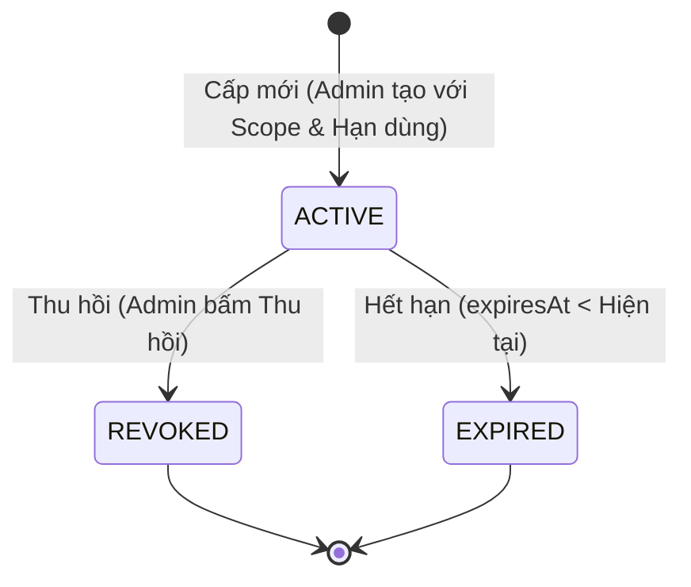
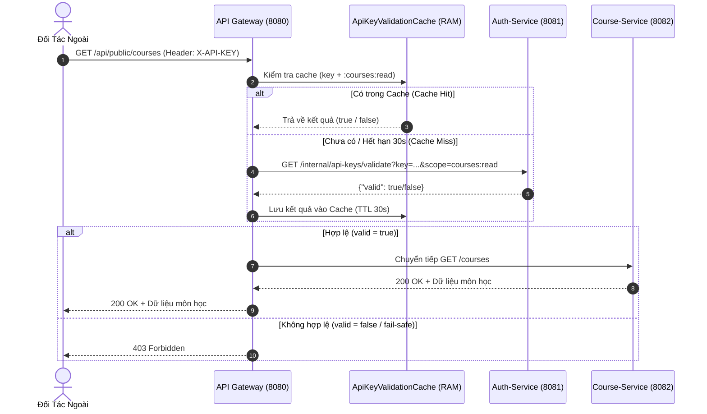

# Tổng Quan Tiến Trình Phát Triển: Buổi Bổ Sung — Quản Lý API Key

Tài liệu tổng kết kiến trúc, thiết kế bảo mật, vòng đời API Key, cache Gateway và kịch bản đối tác trong dự án **CRS Microservices**.

---

## 1. Bối Cảnh & Mục Tiêu

Ở Buổi 4, hệ thống CRS sử dụng một khóa API tĩnh (`crs-partner-key-2026`) ghi cứng trong file cấu hình `application.yml` của API Gateway. Cách làm này có các hạn chế lớn trong thực tế:
- Không thể thu hồi riêng lẻ từng đối tác mà không khởi động lại Gateway.
- Không phân biệt được đối tác gọi request, không đo lường được hạn mức/lưu lượng.
- Không hỗ trợ hạn sử dụng (expiration) hay phân chia quyền hạn theo API (`scope`).

**Buổi Bổ Sung** nâng cấp toàn diện cơ chế trên thành hệ thống quản lý API Key động:
- Đặt tại `auth-service` (nơi quản lý định danh và bảo mật).
- Sinh khóa an toàn bằng `SecureRandom`.
- Vòng đời: `ACTIVE` $\rightarrow$ `REVOKED`.
- Phân quyền theo scope (`courses:read`).
- API Gateway kiểm tra động kèm cơ chế đệm trong bộ nhớ (`ConcurrentHashMap`) TTL 30 giây.
- Giao diện Admin chuyên dụng trên `crs-frontend` để cấp phát và thu hồi tức thời.

---

## 2. Mô Hình Dữ Liệu & Vòng Đời API Key

### Bảng Cơ Sở Dữ Liệu `api_key` (`auth_db`)
| Trường | Kiểu | Ràng buộc | Mô tả |
| :--- | :--- | :--- | :--- |
| `id` | `Long` | Primary Key, Auto Increment | Định danh nội bộ |
| `key_value` | `String(100)` | Unique, Not Null | Chuỗi bí mật tiền tố `crs_` |
| `owner_name` | `String(255)` | Not Null | Tên đối tác sở hữu key |
| `scopes` | `String(500)` | Not Null | Danh sách scope phân tách bằng dấu phẩy |
| `status` | `String(20)` | Not Null | `ACTIVE` hoặc `REVOKED` |
| `expires_at` | `DateTime` | Nullable | Thời điểm hết hạn (null = vĩnh viễn) |
| `created_at` | `DateTime` | Not Null | Thời điểm tạo khóa |

---

## 3. Kiến Trúc Luồng Xác Thực Đối Tác

---

## 4. Các Thành Phần Đã Triển Khai

### 4.1. `auth-service`
- `entity/ApiKey.java`: Entity JPA.
- `repository/ApiKeyRepository.java`: JPA repository tìm kiếm theo `keyValue`.
- `dto/ApiKeyCreateRequestDTO.java` & `ApiKeyResponseDTO.java`.
- `service/ApiKeyService.java`: Logic sinh key ngẫu nhiên an toàn, kiểm tra hợp lệ theo scope.
- `controller/ApiKeyController.java`: API CRUD cho Admin (`/api-keys`).
- `controller/InternalApiKeyController.java`: Endpoint nội bộ `/internal/api-keys/validate`.
- `security/JwtAuthFilter.java` & `config/SecurityConfig.java`: Phân quyền `/api-keys/**` cho `ROLE_ADMIN`, cho phép nội bộ và xác thực đăng nhập.

### 4.2. `api-gateway`
- `application.yml`: Bổ sung route `/api/api-keys/**` về `auth-service:8081`, loại bỏ key tĩnh cũ.
- `cache/ApiKeyValidationCache.java`: Cache 30 giây bằng ConcurrentHashMap.
- `config/WebClientConfig.java` & `client/AuthServiceClient.java`: WebClient gọi nội bộ cơ chế Fail-Safe.
- `filter/ApiKeyFilter.java`: Bộ lọc toàn cục kiểm tra cache và scope.

### 4.3. `crs-frontend`
- `types/apiKey.ts`: Khớp nối dữ liệu DTO.
- `api/apiKeyApi.ts`: Client gọi API qua Gateway.
- `pages/ApiKeysPage.tsx`: Giao diện Admin tạo key, bảo mật hiển thị key 1 lần duy nhất, thu hồi trực tiếp.
- `App.tsx` & `components/Navbar.tsx`: Route và điều hướng menu Admin.

---

## 5. Hướng Dẫn Kiểm Thử Thủ Công Đầu-Cuối

1. **Đăng nhập Admin**: Truy cập `http://localhost:5173/login`, đăng nhập bằng `admin` / `admin123`.
2. **Cấp Key mới**: Vào menu "Quản lý API Key", điền thông tin và bấm "Cấp API Key". Lưu lại chuỗi key sinh ra (dạng `crs_...`).
3. **Gọi API đối tác**: Dùng Postman hoặc cURL gọi `GET http://localhost:8080/api/public/courses` với header `X-API-KEY: <key>`. Nhận mã `200 OK`.
4. **Kiểm tra Cache 30s**: Gọi lại lần 2 ngay lập tức, Gateway xử lý nhanh qua cache RAM.
5. **Thu hồi Key**: Bấm nút "Thu hồi" trên bảng Admin.
6. **Kiểm chứng Thu hồi**:
   - Gọi lại ngay trong 30s: Có thể vẫn được 200 do cache cũ.
   - Sau 30s: Gateway nhận trạng thái `REVOKED` và trả về `403 Forbidden`.
